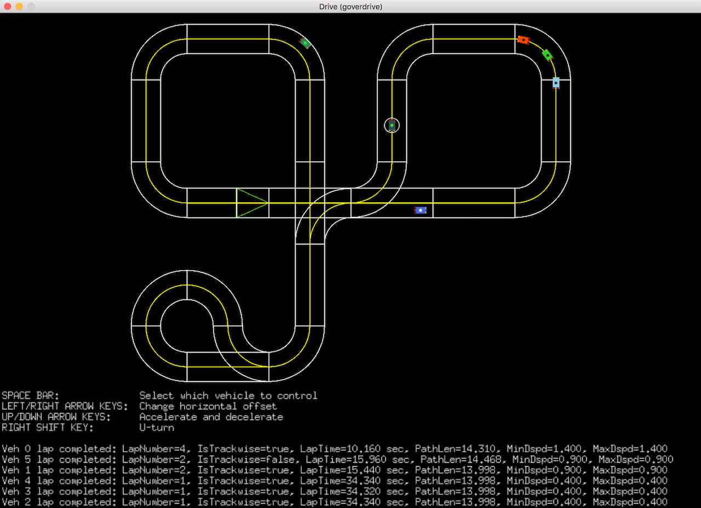

# goverdrive

A lightweight, standalone OverDrive simulator.

- Written in Go
- Designed to be a tool for Game Design on top of the OverDrive robotics platform
- Created by Gabriel Wenz (`gwenz@anki.com`)




## Features
- Any fixed-width track made up of arbitrary straight and curved road pieces
- Any number of vehicles
- Control driving speed, offset from road center, and driving direction of each vehicle
- Perfect knowledge of vehicle position and state at all times
- Collision detection
- Flexible vehicle lights geometry and control
- Programs compile in ~1 second and launch instantly
- Build working game prototypes with <500 lines of code

### Not Supported / Not Present
- Multi-loop tracks
- Fancy track pieces like Intersection and Jump Piece
- AI of any kind
- Path planning
- Default game logic, weapons, etc


## Requirements

- Go
- OpenGL development libraries. See the documentation for [Pixel](https://godoc.org/github.com/faiface/pixel).


## Installation Instructions

Background reading, for new Go developers:
  [Go Code Organization](https://golang.org/doc/code.html#Organization)

1. Install Go
2. Setup the project work area and download source files

For example: `~/proj/go/goverdrive/`
```
$ cd ~/proj/go/
$ mkdir goverdrive
$ cp ~/Downloads/proj_setup.sh goverdrive/proj_setup.sh
$ chmod +x goverdrive/proj_setup.sh
$ cd goverdrive
$ ./proj_setup.sh
```

3. Build example programs
```
$ make examples
go build github.com/anki/goverdrive/games/example/mover/
go build github.com/anki/goverdrive/games/example/drive/
go build github.com/anki/goverdrive/games/example/sidetap/
go build github.com/anki/goverdrive/games/example/zoneshapes/
```

4. Run an example of your own configuration:
```
$ ./drive -h
Usage of ./drive:
  -ins
    	Display instructions at the start of each game phase
  -mb uint
    	Message board height, expressed as integer number of pixels. Can be 0. (default 200)
  -t string
    	Track name or modular track string (default "Capsule")
  -tmaxcofs float
    	Track max center offset, from road center
  -twidth float
    	Track width, in Meters (default 0.2)
  -v string
    	List of vehicles, using two-letter abberviations; eg "gs sk" for Groundshock and Skull (default "gs")
  -w string
    	Window size, expressed as integer pixels WIDTHxHEIGHT (default "1200x850")
```
or this canned one:
```
$ ./drive -t loopback -v "gs th"
```


## Example Programs

See [games/example/](games/example/README.md)


## Enhancment Ideas

* Helper module: `gameutil/shapes/animation`. Examples to consider:
  * Explosion
  * Weapon
  * Persistent "jet flame" from vehicle
  * Rotating coins or mines
* Generalize user input in gameloop.RunGamePhase, eg use empty interface => enable batch-mode sims
* gameutil/vehtraj - track trajectory a vehicle; then view, analyze, write to file, etc
* Force-based robotics simulator

