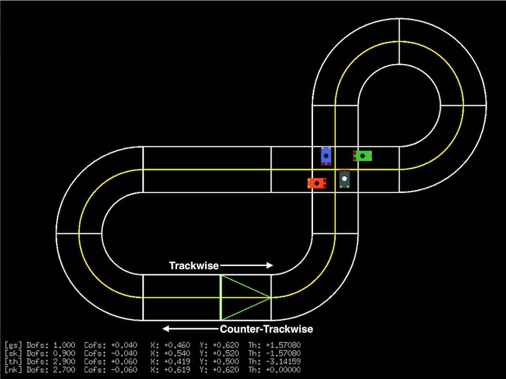

# PHYSICAL UNITS

Fundamental physical units are defined in the `phys` package.

In all representations:

- Unit of length is Meters, since real physical objects are being modeled
- Unit of angle is Radians (not Degrees), since that's how math works
- Other units, such as mass, also use metric

# THE WORLD

The "world" is a coordinate space with two dimensions. Superstring
Theory be damned.

Depending on the needs of the moment, Cartesian or Polar coordinates
may be used.

## Cartesian 

- X is the primary axis
- Y is the secondary axis
- Z, if it were present, would be the tertiary axis, and would follow the Right Hand Rule

## Polar

- R is the radius (Meters)
- Phi is the angle (Radians)
- Converting between Cartesian and Polar coordinates is easy

## Pose

A pose in two-dimentional space adds an angle, Theta, to specify the
orientation of an object. In the case of vehicles, this is the
direction they are facing.

- Theta is in Radians

# THE TRACK

The track is a non-Euclidean 2D coordinate space. Track points are
specified using a distance offset and center offset, and these values
"bend" to match the shape of the track.

## Trackwise and Counter-Trackwise

Like a clock, the track has a natural "forward" driving direction,
which is called Trackwise. For modular OverDrive tracks, this is
determined by the orientation of the Start Piece.

Counter-Trackwise means opposite of the track's natural forward
driving direction.

## Dofs
Dofs is the primary axis for track coordinates

- Dofs is short for "Distance Offset"
- Measures the distance from the finish line along road center, in trackwise direction 
- Unit is Meters
- Dofs values are cyclic, like the angle for a polar coordinate system
- Dofs will never exceed the track length (at road center)

## Cofs

Cofs is the secondary axis for track coordinates

- Cofs is short for "Center Offset"
- Measures displacement from road center
- Unit is Meters
- The road center is at Cofs=0
- In trackwise driving direction, Cofs>0 is left of road center

## Vofs
Vofs is NOT present; if it were present, would be the tertiary axis

- Vofs is short for "Vertical Offset"
- Would measure the height of the track off the ground
- Would follow the Right Hand Rule

## Track Pose

Similar to the Cartesian "World" coordinate space, Track Pose adds an
angle, DAngle, to a vehicle's Track Position. However, the Track Pose
angle is not absolute. Instead, it is a DELTA amount from the
Trackwise driving direction at that point in the track.

- DAngle is in Radians
- A vehicle that is driving Trackwise with no active Cofs changes will have DAngle=0
- A vehilce that is driving Counter-Trackwise with no active Cofs changes will have DAngle=Pi

# DRIVE FRAME-OF-REFERENCE

The "Drive" frame-of-reference takes the reference object's pose into
account when determining the Dofs and Cofs values. (In most cases, the
object is a vehicle that is driving on the track, hence the name
"Drive".) Positions are still measured w.r.t. fixed track landmarks:
the Finish Line and road center.

When the object is facing Trackwise, Dofs and Cofs meaning is as
described above.

When the object is facing Counter-Trackwise, however, the Drive
frame-of-reference has:

1. Sign of Cofs (`+` or `-`) is reversed
  - Cofs>0 means LEFT of road center in object's frame-of-reference,
    which is RIGHT of road center in the Trackwise direction.

2. Dofs is the distance from the Finish Line in the "driving"
   direction of the object,
  - This is the same as the distance REMAINING in the Trackwise direction.
  - Dofs values in Drive frame-of-reference will still be in the range
    (0 < Dofs < Track.CenLen())

This may all seem a bit confusing, but in practice it's easy enough to
work with. In most cases, the Drive frame-of-reference simplifies code
that works with vehicles, because that code can be agnostic to the
actual driving direction of the vehicle.

## DriveDelta Measurements

DriveDelta measures Dofs/Cofs distances relative to an object itself,
not relative to fixed track landmarks such as the Finish Line and road
center. For example, if Vehicle B is exactly 0.2 meters behind Vehicle
A, then DriveDeltaDofs from Vehicle A to Vehicle B would be -0.2.

DriveDelta measurements are handy in various game situations, such as
maintaining a formation relationship between vehicles, or checking if
one vehicle has passed another vehicle.

# COMBINED WORLD AND TRACK 

## Track and World Coordinates Overlay

The midpoint of the track's Finish Line is always placed at the origin
of the World, ie (X=0, Y=0). The trackwise driving direction starts in
the +X direction.

## Converting Between World and Track Coordinates

Converting a point in Track coordinate space to World coordinate space

- Straightforward
- 1-to-1 mapping

Converting a point in World coordinate space to Track coordinate space

- Not always straightforward, due to overlapping track pieces
- Not a 1-to-1 mapping

## Visual Examples

The images below show several vehicles on the track. For each vehicle,
the Cartesian and Track coordinates are printed in the message board
area of the display.

- The World origin is always the start piece, with +X to the right.
- The start piece is indicated with a lime green triangle.
- Vehicle names are abbeviated (gs=Groundshock, sk=Skull, etc)

